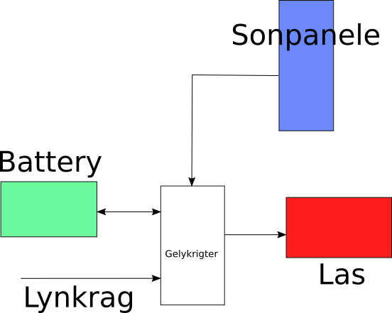

# Data Prosessering vir die Axpert Gelykrigter

Python pakket met standaard funksie wat die energievloei van 'n Axpert  gelykrigter analiseer.

Die vloei van energie word met die volgende vloeidiagram analiseer:

Die funksies in die pakket moet die volgende vrae beantwoord:

- Hoeveel energie kan battery werklik stoor en lewer.  Dit is moontlik dat 'n battery wat 400Ah kapasiteit het glad nie naby hierdie kapasiteit kan lewer nie.  Ondersoek hierdie stelling.
- Hoeveel energie word uit lynkrag gebruik.
- Hoeveel kWh lewer die sonpanele en hoe vergelyk dit met die spesifikasie van die panele.  Dus:  Lewer 'n 330W paneel werklike 330W en hoe varieer die lewering tussen seisoene in die jaar.
- Wat is die drywing van al die laste tans en wat is die energie wat deur die las gebruik word.  Hoe varieer dit met tyd.

Doel van berekenings

- Bepaal hoeveel battery krag is gebruik in Ampere uur. Bepaal hoe lank die yskaste op battery kan loop
- Bepaal hoeveel siklusse die battery gedoen het.  Hoeveel keer is die battery laat afloop na die limiet spanning toe.  Gebruik 'n rainflow counter indien nodig om die siklusse te tel.  Dit is moontlik dat gedurende gewone gebruik dat die battery afloop na 'n lae spanning toe omdat die sonkrag te min is.  Maak 'n grafiek van hoeveel keer die battery afgeloop het.
- Meet hoeveel sonkrag kan per dag opgegaar word. En of dit genoeg is om las te trek
- As dit nie genoeg sonkrag verskaf nie, hoeveel is die bydrae van die lynkrag in Rand
- Teen watter battery Volts moet die inverter teruggaan na lyn krag om nie die battery se lewe te verkort nie?
- Werk uit die gelykbreek tydperk van die stelsel deur die kragbesparing met panele te bepaal
- Bepaal hoeveel krag is beskikbaar vanaf panele op 'n bewolkte dag

Die volgende plot funksies is beskikbaar:

- Plot drywing teen die tyd in die dag vir verskillende items
- Plot drywing vir verskillende dae in die jaar.

Data word met die Axpert gemeer per dag.  Die data word in 'n tekslêer gestoor wat ongeveer 1MB groot is vir elke dag.

Die data het partykeer foute in.  Daar is Linux opdragte wat voor die tyd op die data uitgevoer word om dit skoon te maak.

Die daaglikse data word dan ingelees in Python.

Dit word dan in 'n groter binêre databasis gestoor vir verder verwerking.

## Axpert Gelykrigter QPIGS

QPIGS<cr>: Device general status parameters inquiry
Computer: QPIGS <CRC><cr>
Device: ($N_1 N_2 N_3 .N_5 N_7 N_8 .N_{10} N_{12} N 13 N 14 .N 16 N 18 N 19 .N 21 N 23 N 24 N 25 N 26 N 28 N 29 N 30 N 31 N 33 N 34 N 35$ 
N 37 N 38 N 39 N 41 N 42 .N 44 N 45 N 47 N 48 N 49 N 51 N 52 N 53 N 55 N 56 N 57 N 58 N 60 N 61 N 62 N 63 N 65 N 66 N 67 .N 69
N 71 N 72 .N 74 N 75 N 77 N 78 N 79 N 80 N 81 b 83 b 84 b 85 b 86 b 87 b 88 b 89 b 90 N 92 N 93 N 95 N 96 N 98 N 99 N 100 N 101 N 102
b 104 b 105 b 106 <CRC><cr>

|      | Symbol             | Description                        | Notes/Unit                 |
| ---- | ------------------ | ---------------------------------- | -------------------------- |
| 1.   | (                  | Start byte                         | N: the integer from 0 to 9 |
| 2.   | $N_1 N_2 N_3 .N_5$ | Grid voltage                       | V                          |
| 3.   |                    | Grid frequency                     | Hz                         |
| 4.   |                    | AC output voltage                  | V                          |
| 5.   |                    | AC output frequency                | Hz                         |
| 6.   |                    | AC output apparent power           | VA                         |
| 7.   |                    | AC output active power             | W                          |
| 8.   |                    | Output load percent                | %                          |
| 9.   |                    | BUS voltage                        | V                          |
| 10.  |                    | Battery voltage                    | V                          |
| 11.  |                    | Battery charging current           | A                          |
| 12.  |                    | Battery capacity                   | %                          |
| 13.  |                    | Inverter heat sink temperature     | deg C                      |
| 14.  |                    | PV Input current 1                 | A                          |
| 15.  |                    | PV Input voltage 1                 | V                          |
| 16.  |                    | Battery voltage from SCC 1         | V                          |
| 17.  |                    | Battery discharge current          | A                          |
| 18.  |                    | Device status                      |                            |
| 19.  |                    | Battery voltage offset for fans on | 10mV                       |
| 20.  |                    | EEPROM version                     |                            |
| 21.  |                    | PV Charging power 1                | Watt                       |
| 22.  |                    | Device status                      |                            |

