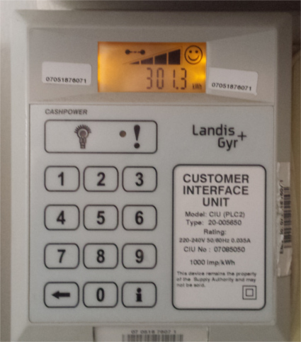
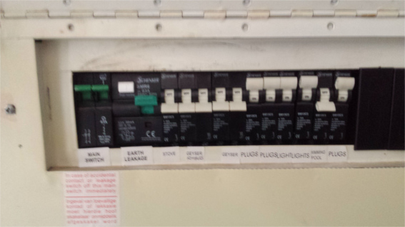
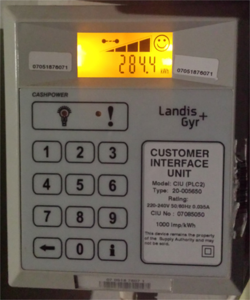
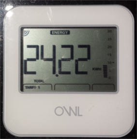
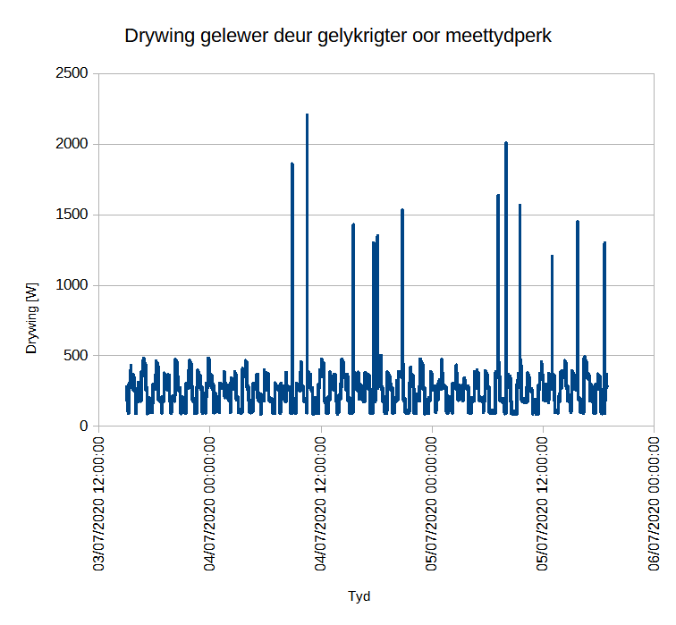

# Gelykrigter kraggebruik

Bereken gelykrigter (inverter) kraggebruik met battery data en die inverter logs.

Twee metodes sal gevolg word om gelykrigter kraggebruik te bereken.

1. Die data van battery logs en gelykrigter logs van 'n warmwater en ligte stelsel wat isoleerd is van die lynkrag.  'n Energiebalans sal gebruik word om die gelykrigter kraggebruik te bepaal.  Hierdie stelsel het geen lynkrag wat inkom nie, dus is die hoeveelheid energie wat gebruik word om die battery bestuurstelsel en gelykrigter aan die gang te hou gelyk aan die fotovoltaiese (PV) krag gelewer minus die verbruikte krag.
2. Die gelykrigter met die yskasstelsel sal op sy eie op die voorafbetaalde kragmeter gesit word en die kraggebruik sal bepaal word.  Alle ander gebruikers word afgeskakel vir die meetperiode.  Die krag gelewer aan die gebruikers sal uit die gelykrigter logs gekry word.  Die verskil tussen die twee syfers is die gelykrigter kraggebruik.

## Probleemstelling

Die gebruikershandleiding van die Axpert beweer dat die geen-las gebruik van die Axpert 5kVa model minder as 50W is.  Dit is gemeet met 'n Owl drywingsmeter en is bepaal om sowat 500W te  wees.  Die 500W is gemeet toe daar geen verbruikers gekoppel was op die Axpert nie.

Dit blyk dat die Axpert 'n groot induktiewe las trek as hy nie 'n ordentlike las op het nie.  Die laaier blyk nie 'n pf-korreksie (drywingsfaktor korreksie) in te hê nie, met  die gevolg dat dit 'n groot meetfout maak indien daar baie skynkrag teenwoordig is.  Die meeste kommersiele drywingsmeters meet net stroom.  Gevolglik word die spanning in so 'n meter ingevoer as 'n konstante.  Hierdie lae koste meters kan dus nie die verandering in spanning meet nie en ook nie die fase tussen die spanning en stroom nie.  Dit is dus nie moontlik om die drywingsfaktor met so 'n lae koste toestel te meet nie.  Die OWL is 'n voorbeeld van so 'n meettoestel.

Na vermoede is die gestadigde meting van 'n voorafbetaalde meterstelsel baie meer akkuraat as 'n goedkoop drywingsmeter.

Die doel van hierdie ondersoek is om 'n beraming van die werklike energiekoste te maak van 'n Axpert 5kVa gelykrigter in normale gebruik.  Aan die een kant dui eenvoudige metings aan dat dit nie weglaatbaar is nie en aan die ander kant beweer die gebruikershandleiding dat die energieverbruik van die Axpert laag is.

Wanneer verwys word na die energie koste van die gelykrigter word die energiekoste van die batterybestuurstelsel ook hierby gegroepeer, omdat dit baie moeilik is om die afsonderlike drywingsbehoeftes van die battery en die gelykrigter te bepaal.  Die waarde van die skeiding is ook nie so hoog nie, omdat die twee drywingsbehoeftes saam die inherente koste verteenwoordig van 'n gelykrigter/batterystelsel.  Dit is hierdie gesamentlike koste wat belangrik is vir haalbaarheidsberekeninge  en gelykbreek analises en nie die kennis van die afsonderlike bydraes van die twee stelsels nie.

## Metings

### Warmwater ligte stelsel meting

Hierdie metings sal in 'n toekomstige weergawe van hierdie verslag ingesluit word.

### Voorafbetaalde meter meting

#### Inleiding

'n Voorafbetaalde elektrisiteitsmeter is teenwoordig in die huis waar die metings gedoen is.  Daar word aangeneem dat hierdie meter redelik akkuraat is met die meting van werklike drywing.  Gebruikers word nie aangeslaan vir skynkrag gemeet in VAR nie.  Gebruikers word net aangeslaan vir werklike drywing gemeet in Watt.  Die gebruikers betaal dan vir energie in die eenheid van kWh, oftewel 'n sekere aantal drywing gelewer oor 'n tydeenheid.  Die feit dat gebruikers betaal vir werklike krag ondersteun dus die aanname dat hierdie tipe meter stroom, spanning en fase van 'n kraglyn behoort te kan meet.

'n Gesprek tussen Gideon de Wet en Niël Agenbag kan gevind word in die lys van byvoegsels tot hierdie verslag.  Dit gee 'n opsomming van die probleemstelling en die besprekings rondom die meting.

In die voorafbetaalde meter toets, is die meter dopgehou en alle ander verbruikers behalwe die verbruikers op 'n Axpert gelykrigter is afgeskakel.  Die energie verskil tussen die einde en die begin van die meting is dus die werklike energie gelewer aan die Axpert en sy gebruikers.  Die gelykrigter se lewering aan gebruikers is geboekstaaf en die generasie van PV krag is ook opgeneem.  Hierdie data kan gebruik word om die behoefte van die gelykrigter/battery kombinasie te bepaal.

Dit is belangrik om te noem dat die gebruikers op die Axpert gelykrigterstelsel vir hierdie toets bestaan het uit 'n ou vrieskas, 'n nuwe yskas en 'n nuwe vrieskas.  Die ou vrieskas het 'n gebruik van 200W as dit aan is en is 'n regop tipe ontwerp.  Die nuwe yskas het 'n gebruik van 100W as dit aan is.  Die nuwe vrieskas het 'n gebruik van 150W indien dit aan is, maar omdat dit 'n staanvrieskas is, hou dit warmte meer effektief uit.  Hierdie gebruikers het almal elektriese motors vir kompressors en verteenwoordig dit 'n groot induktiewe las.  Daar kan dus 'n groot fout verwag word indien 'n meter gebruik word wat nie die drywingsfaktor in ag kan neem nie.

#### Meterlesings

Begin Axpert meting 301.3 op 2020-07-03 15:00

Eindig Axpert meting 284.4 op 2020-07-05 18:54

Die verdeelkas (DB board) het die volgende instellings gehad.  Net die Axpert het krag gekry met die muurproppe.  Alle ander toestelle is uitgeprop uit die muurproppe.  Net die yskaste en TV is ingeprop op die gelykrigter se proppe.

Die lesing op die OWL drywingsmeter was as volg:

Die voorafbetaalde meter het dus 16.9kWh gelees in 51.9 uur en die OWL drywingsmeter het 24.22kWh gelees in dieselfde tydperk.  Die voorafbetaalde meter word geneem as die maatstaf omdat die energie betaal word op die basis van hierdie meter se lesing.  Dus het die OWL drywingsmeter 7.32kWh te veel gelees oor die tydperk en dit werk uit op 'n gemiddeld  van 141W wat te veel gelees word op enige gegewe tyd.

Die lesingsfout wat die OWL maak kan toegeskryf word aan die feit dat die OWL net stroom gelewer meet en nie ook die spanning meet nie.  Dit kan dus nie onderskei tussen skyndrywing en ware drywing nie.  Die drywingsfaktor van die laste gekoppel tydens die eksperiment is laer as 0.8 omdat die laste meestal induktiewe laste is.  Die laste was oorwegend yskaste wat kompressormotors het wat 'n induktiewe las veroorsaak.  Die OWL meter lees dus die totale drywing wat 'n groot komponent skyndrywing bevat en dus oorskat die lesing die werklike drywing.  Die OWL vereis dat die gebruiker 'n spanning intik wat die gemiddeld is wat verwag word, naamlik 240V in hierdie spesifieke geval.  Dit lei tot die oorskatting.  Die OWL kan dus net vir vergelykende metings en AAN/AF tipe metings gebruik word, of in die onwaarskynlike geval dat daar 'n suiwer weerstandslas is.  Die mengsel van laste in 'n huis is meestal induktief van aard, dus is dit nie baie prakties vir die toepassing nie.

#### Axpert drywing leweringslesing

Hier volg die drywing van die Axpert oor die tydperk.  Die data word in grafiek vorm voorgestel.  Dit verteenwoordig die data wat aan die laste gelewer is wat aan die Axpert gekoppel is vir die toets periode van 15:00 op 2020-07-03 tot 18:54 op 2020-07-05.  Die laste was twee vrieskaste en een yskas soos voorheen genoem.

Indien die area onder die grafiek integreer word met betrekking tot tyd, kan die energie wat deur die Axpert in die periode gelewer is bereken word in kWh.  Die area onder hierdie grafiek en gevolglik die energie gelewer deur die Axpert aan die las is 12.76kWh.  Dit sluit die energie wat die Axpert self gebruik het uit.

As ons nou in ag neem dat die voorafbetaalde meter 16.9kWh gemeet het in die tydperk, dan kan ons bereken dat die Axpert en die battery beheerstelsel (BMS) saam 16.9 - 12.76 = 4.141kWh se energie gebruik het in die tydperk.  Indien ons dit deur die aantal uur deel, kry ons 'n gemiddelde drywing van:

$$
P_{gem} = \frac{4.141kWh}{51.9uur} = 79.8W
$$

Die gemiddelde drywing van die Axpert is dus 79.8W oor die gemete tydperk.
Die sonpanele van die stelsel is afgeskakel tydens die toets om die effek van panele uit die vergelyking te haal.  Dus het die panele geen drywing bygedra nie en het alle drywing dus van lynkrag af gekom.

## Gevolgtrekkings

Die metings het getoon dat die Axpert en battery beheerstelsel 'n gemiddelde drywing van 79.8W oor die gemete tydperk gehandhaaf het.

Die gemete waarde is meer as die 50W wat die Axpert vervaardiger in die brosjure adverteer, maar daar moet in aggeneem word dat die batterybeheerstelsel ook elektrisiteit gebruik.

Die drywing van die Axpert is laag, maar nie weglaatbaar nie.  Neem in ag dat met 'n gemiddelde drywing van 79.8W die Axpert ongeveer 1.9kWh per dag benodig en dus 698.9kWh per jaar benodig om te funksioneer.  **Indien die stelsel dus nie sonpanele het wat meer as 1.9kWh per dag kan produseer nie, sal die stelsel 'n nettor energie gebruiker wees en duurder wees as 'n huis sonder 'n gelykrigter stelsel.**

Die akkuraatheid van goed kommersiële drywingsmeters is bewys om baie swak te wees, omdat huise heelwat induktiewe laste het.  Dit lei tot baie onakkurate lesings op hierdie toestelle wat die spanning as 'n konstante waarde neem en die stroom meet.  Die gebruik van hierdie toestelle word afgeraai.

## Byvoegsels

### Boodskapgesprek:  Gideon de Wet en Niël Agenbag

Die volgende gesprek bespreek die eksperiment van die meting:

[21:02, 6/29/2020] Gideon: Die prepaid meters is meer akkuraat, maar nie met oombliklike drywingsverbruik nie, maar akkumulatiewe energieverbruik
[21:03, 6/29/2020] Gideon: Jy moet mbv jou prepaidmeter ‘n eksperiment oornag doen (minstens 8 ure of so)
[21:03, 6/29/2020] Gideon: En vgl met Axpert log
[21:03, 6/29/2020] Gideon: Dan doen jy aftreksom en bereken gem drywingverlies

Mmmm. Ek gaan hierdie naweek vereeniging toe. Ek dink dit is goeie geleentheid vir so 'n toets. Goeie idee. Ek sit dan alles af behalwe die Axpert op die yskaste.
In parallel gebruik ek die goedkoop drywingsmeter as ekstra toets.
[21:06, 6/29/2020] Gideon: Ok sy onakkuraatheid te bevestig ja
[21:06, 6/29/2020] Gideon: Om
Ok dit is dan die beste wat ons vir nou kan doen.
Dit sal dalk seker beter wees om vir die eksperiment die Axpert se panele af te dit en dit net op eskom krag te loop die hele naweek. Dan is die krag na batterye basies net "float". Stem jy saam
Dan is die verskil tussen wat die Axpert lewer aan die las en die kragmeter se syfer die Axpert se eie gebruik.
Ja jy sal sonpanele moet afhaal
Reg so.
Vir die eksperiment inverter
Ja die ander een se lynkrag gaan ek afsit. Die een met die ligte is buitendien van die grid af tegnies omdat ligte so min krag vat.

Belangrik vir ons meting is dat ons net regte drywing gaan meet met die prepaid. Blykbaar is die drywingsfaktor nie so groot faktor vir eskom nie. Dus vra hulle jou as huis nie geld vir die skynkrag wat jy gebruik nie. Vir komersiële gebruikers vra hulle geld vir die skynkrag sodat hulle forseer word om PF korreksies te doen.
So al is daar baie VAR in die stroombaan gaan ons nie kyk daarna nie want ons metertjies meet net regte drywing in kW.
Ek sê dit want ek gaan net die kW logs van Axpert gebruik.
Dis wat ek sê dis wat ek sê
OK dis mooi. Ek het nie geweet ons is so klein dat ons VAR verniet is nie.
So as die Owl metertjie sleg is gaan ons groot verskil tussen hom en die prepaid sien.
Dis die eerste afleiding wat ons wil maak: hoe sleg is die goedkoop metertjie.
Die tweede ding wat ons wil weet is wat is die delta tussen die kWh van die prepaid en die kWh regte drywing wat die Axpert aan sy netwerk lewer.
[23:13, 6/29/2020] Gideon: Dis die vermoede. Onthou dat skynkrag nie noodwendig drywing kos nie. Mens kan groot vAR’e opwek maar die turbines kom dit nie agter nie, maar dis onbruikbaar. Slegs die weerstand in die drade/klosse is die koste
[23:13, 6/29/2020] Gideon: Van die generator
Ek log elke 10 sekondes. So daar gaan 'n klein foutjie wees. Want ek gaan die 0.1Hz kW sein integreer om die energie te kry.
Skuus, VAr’e

[23:17, 6/29/2020] Gideon: Jou metertjie meet die skyndrywing, wat glad nie akkuraat is is die pf ver van 1 af is nie
[23:17, 6/29/2020] Gideon: *is as

#### 