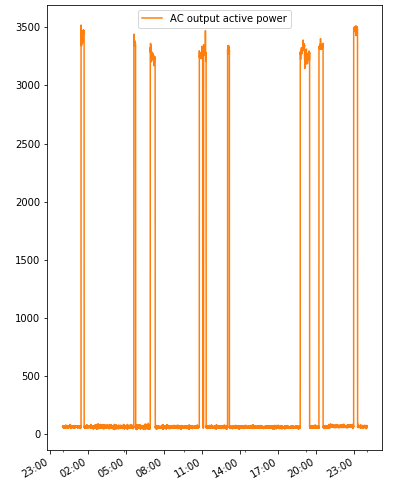
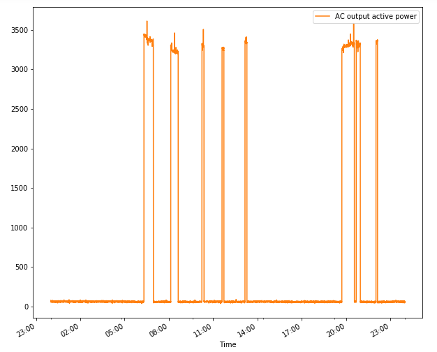

# Geyser kraggebruik

Karakteriseer geyser kraggebruik uit metings.  Bepaal hoeveel kWh die geyser tipies per dag gebruik.  Doen dit deur die inverter metings en die prepaid kragmeter se data te vergelyk.

## Metings

Geyser val van 0100 in oggend van 55 na 45 grade.  Gemeet op 30 April 2020 met termokoppel termometer op multimeter.

Geyser is gestel op 55 grade.

Die volgende ding wat ek wil kyk is of daardie twee grafieke ongeveer 8kWh se energie verteenwoordig
Die integraal van daardie grafiek met betrekking tot tyd is energie in kWh
Ek vermoed 1 geyser vir 'n gesin is 8kWh
Ek sien dit uit die kraglesings

Loop geyser vandag (van 12:52 op 29 Mei 2020) deur inverter om baie koue gebruik van geyser te monitor

Min temp was 3 grade gisteraand

Min temp vanaf 00:00 op 30 Mei 2020 was:

## Waarnemings

Maar die geyser sit glad nie baie aan en af nie. So die histerese of die aan af punt is baie "los"
So geysers is seker so gemaak om "hunting" te bekamp

## Strategie

Skeduleer die geyser om dan nie meer as voorheen per dag te gebruik nie, maar die son te gebruik om krag aan te vul.

Ek dink aan 'n strategie om in die dag die geyser tot 70 grade te laat warm word met sonkrag.  Dan 'n baie kort rukkie in die oggend 5 uur net aan te sit.  Vir die oggend stort water.  So dit is dan 1 aan siklus met sonkrag en 1 siklus met lynkrag vir kort rukkie.  Dan verloor jy geen gemak nie en hou die energieverbruik onder dit wat dit was met net 'n termostaat wat die beheer gedoen het.

